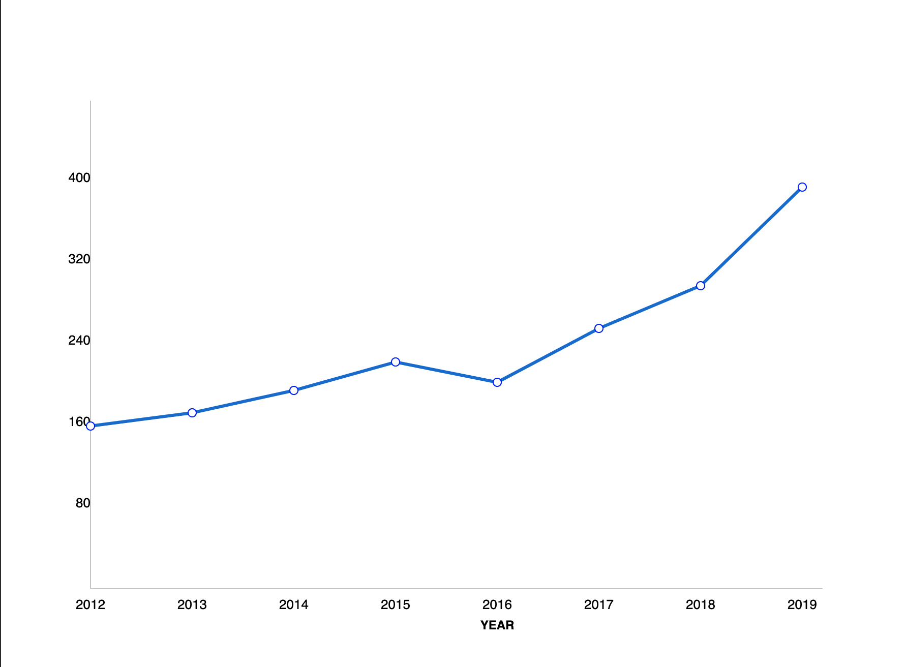

# inter-vue

re-create the graph. The graph should work with any amount of data given in the json-format shown below.




- dont use any external libraries
- gap between segments on the x axis is 100, 80 on the y axis
- the x axis is offset by 80 and the y by 100
- css styling is give as is. No need to change it

## Project setup

```
npm install
```

### Compiles and hot-reloads for development

```
npm run serve
```

### Compiles and minifies for production

```
npm run build
```

### Lints and fixes files

```
npm run lint
```
